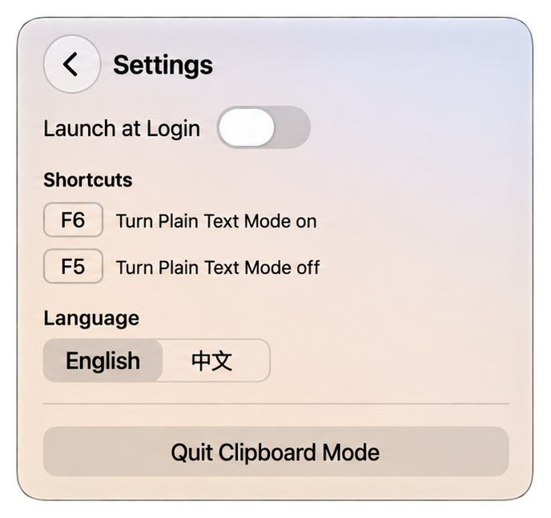

# Clipclean

**English** | [中文](README.zh-CN.md)

A tiny clipboard utility that strips rich text, so every paste is plain text.
Native on **macOS** and **Windows**.

When **Plain Text Mode** is on, every copy is reduced to its plain-text
representation: fonts, colours and other rich flavours are dropped, while
Unicode, emoji, tabs and line breaks are preserved. When it is off, the
clipboard behaves exactly as the system normally does.

Both builds live in the menu bar / system tray only — no Dock icon, no taskbar
window, no installer.

## Platforms

| | macOS | Windows |
| --- | --- | --- |
| Source | [`com.clipclean.paste/`](com.clipclean.paste) | [`clipclean-windows/`](clipclean-windows) |
| Requirements | macOS 14.0 or later (Apple Silicon or Intel) | Windows 7 SP1 or later (32- or 64-bit) |
| Built with | SwiftUI / AppKit (Xcode 26+) | Win32 / C++17 (MSVC or MinGW, no .NET) |
| Distribution | `build/Clipclean-<version>.dmg` | `clipclean-windows/dist/Clipclean.exe` |
| Backdrop | Liquid Glass on macOS 26+, translucent material on 14–15 | Solid panel that follows the system light / dark theme on Windows 10/11 |

## Features

- Menu bar (macOS) / tray (Windows) icon with a right-click menu:
  Mode ▸ On / Off, Settings, Quit
- Left-click opens a small panel with a large slide switch
- Global hot keys: `F6` turns Plain Text Mode on, `F5` turns it off
- Launch at Login (macOS) / Start with Windows (Windows)
- English / 中文 switch inside Settings
- On Windows 10 and 11 the panel follows the system light / dark appearance;
  on Windows 7 and 8 a manual light / dark switch is always available
- No network access, no clipboard history

## Screenshots

macOS:

| Main panel | Settings | Right-click menu |
| --- | --- | --- |
|  |  |  |

## Behaviour

**Plain Text Mode: On**

- The clipboard is watched for changes — a run-loop timer polling `changeCount`
  on macOS, `AddClipboardFormatListener` on Windows.
- The best available text is taken from plain text, then RTF, then HTML.
- The clipboard is rewritten with that text only, so an RTF-only or HTML-only
  clipboard is still reduced.
- Unicode, emoji, tabs and line breaks are preserved, including astral-plane
  characters (surrogate pairs).
- The app ignores the change produced by its own write, so it can never loop.
- Image-only clipboards and file (URL) copies are left untouched.
- A clipboard that is already plain text is not rewritten.

**Plain Text Mode: Off**

- Nothing reads or writes the clipboard.

## Shortcuts

| Key | Action |
| --- | --- |
| `F6` | Turn Plain Text Mode on |
| `F5` | Turn Plain Text Mode off |
| `Esc` | Leave Settings |

Neither platform needs Accessibility or Input Monitoring permission for the
hot keys.

> **macOS laptops:** the top row defaults to media keys, so F5/F6 alone may not
> reach the app. Hold `Fn` (`Fn+F6` / `Fn+F5`), or enable *System Settings →
> Keyboard → Keyboard Shortcuts… → Function Keys → “Use F1, F2, etc. keys as
> standard function keys”.*

## Install

- **macOS** — download `Clipclean-<version>.dmg`, open it and drag **Clipclean**
  into **Applications**.
- **Windows** — run `clipclean-windows/dist/Clipclean.exe`. There is no
  installer; put it anywhere and tick *Start with Windows* in Settings.

The macOS build in Releases is signed locally, not notarized, so on first
launch macOS may warn. Right-click the app and choose **Open**, or allow it
under **System Settings → Privacy & Security**.

## Building

### macOS

```sh
open com.clipclean.paste.xcodeproj   # then ⌘R
./scripts/package-dmg.sh             # build/Clipclean-<version>.dmg
```

See [`com.clipclean.paste/README.md`](com.clipclean.paste/README.md) for signing
and notarization.

### Windows

```bat
cmake -S clipclean-windows -B clipclean-windows/build -G "Visual Studio 18 2026"
cmake --build clipclean-windows/build --config Release
```

See [`clipclean-windows/README.md`](clipclean-windows/README.md) for MinGW and
tests.

## Layout

```
com.clipclean.paste/      macOS app — Swift sources and Xcode project
  Screenshots/            README screenshots
  scripts/package-dmg.sh
clipclean-windows/        Windows app — Win32 / C++17 sources and CMake project
  dist/                   prebuilt Clipclean.exe
  res/                    icons, manifest, version info
  tests/                  pure-logic unit tests
```

## Deliberately not included

No clipboard history, search, cloud sync, AI, OCR, or extra settings.

## License

Apache-2.0. See `LICENSE`.
