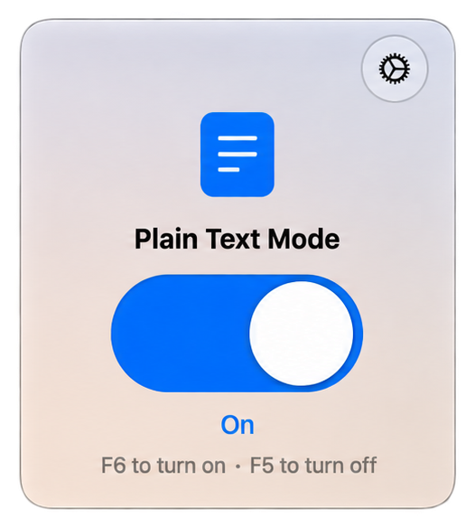
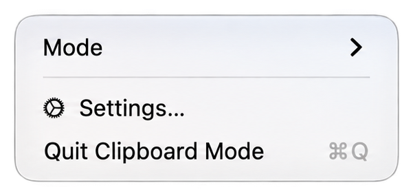

# Clipclean

[English](README.md) | **中文**

一个极小的原生 macOS 菜单栏工具：把剪贴板里的富文本剥成纯文本。

开启**纯文本模式**后，每次复制都会被还原为纯文本表示：字体、颜色等富文本格式被丢弃，而 Unicode、emoji、制表符和换行完整保留。关闭时，剪贴板行为与 macOS 原生完全一致。

- 仅菜单栏 —— 无 Dock 图标，无主窗口
- 液态玻璃面板 + 大号滑动开关
- 右键菜单栏图标：模式 ▸ 开 / 关、设置、退出
- 全局快捷键：`F6` 开启纯文本模式，`F5` 关闭
- 开机自启
- 设置内可切换 English / 中文
- 无网络访问、无权限申请、无剪贴板历史

## 截图

_待补充。_

<!--
  把 01-main.png、02-settings.png、03-menu.png 放进 Screenshots/ 后，
  取消下面表格的注释即可。

| 主面板 | 设置 | 右键菜单 |
| --- | --- | --- |
|  |  |  |
-->

文件名说明见 [`Screenshots/`](Screenshots)。

## 系统要求

- macOS 14.0 或更高（Apple Silicon 或 Intel）
- 构建需要 Xcode 26+

在 macOS 26 及以上使用 SwiftUI 液态玻璃；macOS 14–25 回退为半透明
`.ultraThinMaterial` 材质。

## 安装

从 [最新 Release](../../releases/latest) 下载 `Clipclean-1.1.0.dmg`，打开后把
**Clipclean** 拖进 **Applications**。

Release 里的构建是本地签名、**未公证**的，所以首次打开 macOS 可能拦截。右键
点应用选**打开**，或到**系统设置 → 隐私与安全性**里放行。

## 行为

**纯文本模式：开**

- 用 run-loop 定时器轮询 `changeCount` 监听剪贴板（macOS 没有公开的剪贴板变更通知）。
- 依次尝试取文本：`public.utf8-plain-text` → RTF → HTML。
- 用取到的文本重写剪贴板，只保留纯文本。
- 保留 Unicode、emoji、制表符和换行。
- 忽略自身写入造成的 changeCount 变化，因此永远不会形成循环。
- 纯图片的剪贴板、以及文件（URL）复制，一律不修改。
- 已经是纯文本的剪贴板不会重写。

**纯文本模式：关**

- 定时器完全停止。不读取、不写入剪贴板。

## 快捷键

| 按键 | 动作 |
| --- | --- |
| `F6` | 开启纯文本模式 |
| `F5` | 关闭纯文本模式 |
| `Esc` | 退出设置页 |

使用 Carbon Hot Key API（`RegisterEventHotKey`）实现，**不需要**辅助功能或输入监控权限。

> **Magic Keyboard / 笔记本**：顶排默认是媒体键，单按 F5/F6 可能到不了本应用。要么按住 `Fn`（`Fn+F6` / `Fn+F5`），要么打开
> *系统设置 → 键盘 → 键盘快捷键… → 功能键 → “将 F1、F2 等键用作标准功能键”。* 2015 款 Magic Keyboard 上这两个键可直接使用。

## 构建

```sh
open com.clipclean.paste.xcodeproj   # 然后 ⌘R
```

Release 构建并打包 DMG：

```sh
./scripts/package-dmg.sh             # 生成 build/Clipclean-1.1.0.dmg
VERSION=1.2.0 ./scripts/package-dmg.sh
```

## 签名与公证（公开分发）

打出的 DMG 使用的是 Xcode 解析到的签名身份（或 ad-hoc）。公开分发需要
**Developer ID Application** 证书并完成公证：

```sh
# 1. 在 Xcode 里用 Developer ID 归档导出，或直接对已构建的 app 签名：
codesign --force --options runtime --timestamp \
    --sign "Developer ID Application: Your Name (TEAMID)" "Clipclean.app"

# 2. 一次性保存公证凭据
xcrun notarytool store-credentials "clipclean-notary" \
    --apple-id "you@example.com" --team-id "TEAMID" \
    --password "app-specific-password"

# 3. 公证并装订
xcrun notarytool submit build/Clipclean-1.1.0.dmg \
    --keychain-profile "clipclean-notary" --wait
xcrun stapler staple build/Clipclean-1.1.0.dmg
```

## 项目结构

```
com.clipclean.paste.xcodeproj
com.clipclean.paste/
  com_clipclean_pasteApp.swift   应用入口（菜单栏 accessory）
  AppDelegate.swift              状态栏图标、面板窗口、热键、右键菜单
  ClipboardController.swift      模式状态 + 剪贴板接线
  PanelModel.swift               SwiftUI 桥接（状态、语言、开机自启）
  ClipboardPanelView.swift       液态玻璃面板
  Localization.swift             English / 中文 文案
  HotKeyCenter.swift             Carbon 全局热键
  PlainTextTransformer.swift     剪贴板 → 纯文本
  PasteboardMonitor.swift        changeCount 监听
Screenshots/                     README 截图
scripts/package-dmg.sh
```

## 刻意不做

不做剪贴板历史、搜索、云同步、AI、OCR，也不做多余设置。
